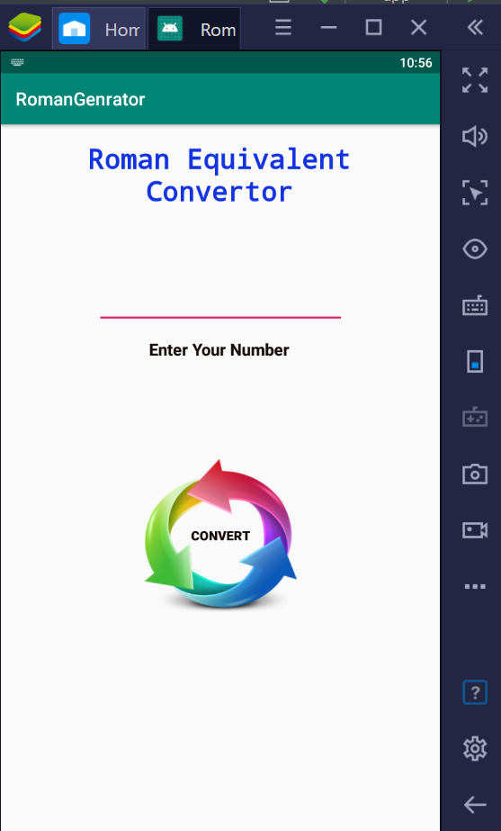
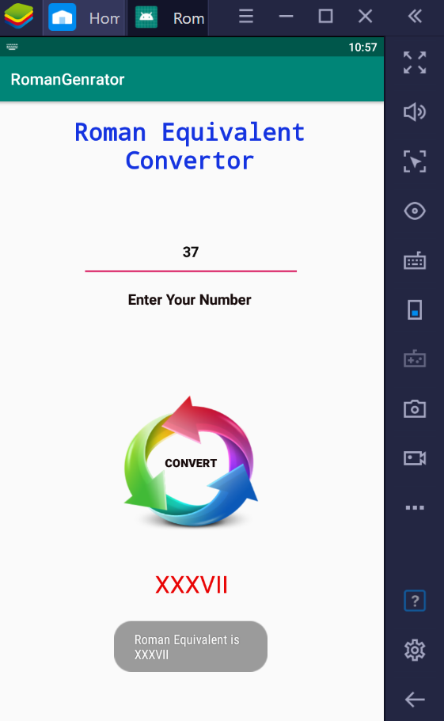
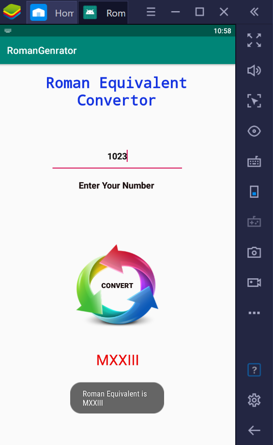

> *This repository contains Android project which is developed for the [**#30DaysOfKotlin**](https://twitter.com/hashtag/30daysofkotlin?lang=en) with Google Developers (Initiative to improve your understanding of Kotlin and apply it in real projects).* 

# Roman-Equivalent-Generator

This is just a sample app which is built with Kotlin🦸superpower and *Modern Android development* tools! 
This app used to comvert the any number into a Roman Equivalents.

---

## Screenshots of App
<table style="width:100%">
  </tr>
  <tr>
    <td></td>
    <td></td>
    <td>
  </tr>
</table>
